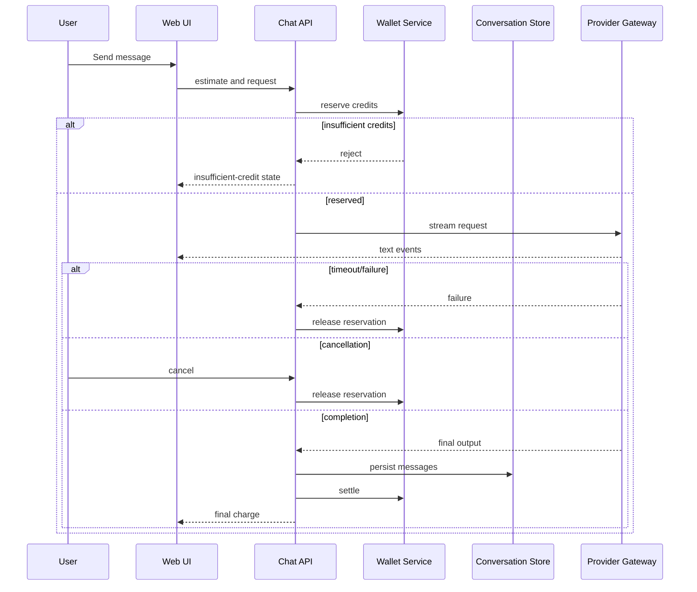

# General Persian Chat PRD

## 1. Document Control

| Field | Value |
|---|---|
| Status | Draft |
| Phase | Phase 1 — In Progress |
| Owner | Product |
| Last updated | 2026-08-19 |
| Approval state | Review required |
| Dependencies | Secure cookie auth, wallet/ledger, provider gateway, conversation store |

## 2. Overview and Business Goal

General Persian Chat is the activation capability: the first useful interaction for
a new user before Studio or marketplace features. It is Persian-first, RTL, and
provider-agnostic. Each billable message has visible credit behavior.

## 3. Target Users

- A first-time individual user needs a low-friction first conversation.
- A returning user needs to reopen prior context without re-explaining it.
- A small-business user needs Persian help drafting operational content.
- A workspace administrator needs metadata-only usage visibility without reading
  private conversation text.

## 4. User Problems and Jobs to Be Done

- Start useful Persian AI interaction immediately after account activation.
- Continue prior work without copying prior messages into a new request.
- Know expected and final credit impact before and after sending.
- Recover from provider or network failures without accidental duplicate charges.
- Control an in-progress generation when its direction is no longer useful.

## 5. User Stories

- As a first-time user, I want to create a new conversation so that I can begin
  asking a Persian question without selecting a persona.
- As a returning user, I want to open conversation history so that I can continue
  an earlier task with its stored context.
- As a credit-conscious user, I want to see an estimate before sending so that I
  can decide whether to spend credits.
- As a user, I want streamed assistant text so that I can begin reading promptly.
- As a user, I want to cancel generation so that I can stop an irrelevant answer.
- As a user, I want to retry a failed request so that a transient provider error
  does not require retyping my message.
- As a user, I want to copy an assistant response so that I can reuse it elsewhere.
- As a user, I want to start a new conversation so that unrelated work stays separate.
- As a user with insufficient credits, I want a clear wallet path so that I can
  resolve the block before provider execution.
- As a user, I want timeout feedback so that I know whether to retry later.
- As a user, I want final charged credits shown so that I can reconcile usage.
- As a workspace administrator, I want metadata-only usage summaries so that I can
  monitor costs without accessing private message content.

## 6. Phase 1 Scope

Authenticated HttpOnly-cookie sessions; conversation list; create/open/continue;
Persian and mixed Persian-English input; submission; streaming output; cancellation;
retry; copy; estimate; reserve; settle; release; final charge; empty/loading/error
states; and conversation persistence.

## 7. Out of Scope

Personas, uploads, image generation/understanding, web search, RAG, marketplace,
agent execution, external actions, real payment activation, and conversation sharing.

## 8. Functional Requirements

1. CHAT-FR-001: A user selecting New Conversation creates a tenant-bound draft ID.
2. CHAT-FR-002: Opening history returns only that tenant's conversation metadata.
3. CHAT-FR-003: Sending rejects empty or whitespace-only messages with inline UI error.
4. CHAT-FR-004: Before provider dispatch, API returns a credit estimate or an
   unavailable-estimate state.
5. CHAT-FR-005: Insufficient spendable credits reject the send before provider call.
6. CHAT-FR-006: A valid send creates one idempotency key and reserves credits.
7. CHAT-FR-007: Provider output is emitted as ordered stream events and shown as partial text.
8. CHAT-FR-008: Cancel requests stop the run and record cancellation actor/state.
9. CHAT-FR-009: Successful completion persists final messages and settles reservation.
10. CHAT-FR-010: Provider failure or timeout releases unused reservation.
11. CHAT-FR-011: Retry reuses the failed request identity and cannot duplicate charge.
12. CHAT-FR-012: Copying an existing response is local UI behavior and never charges credits.
13. CHAT-FR-013: Reading history never charges credits.
14. CHAT-FR-014: Conversation and messages enforce tenant isolation at every read/write.
15. CHAT-FR-015: Admin visibility exposes usage metadata only, never raw content.
16. CHAT-FR-016: Error responses classify unauthorized, network, timeout, provider,
    and billing failure without exposing provider credentials.

## 9. Billing State Model

| State | Trigger | User-visible message | Ledger effect | Recovery |
|---|---|---|---|---|
| Estimate shown | Valid draft | Estimated credits shown | None | Send or edit |
| Reservation pending | Send clicked | Checking credits | Pending request | Wait/retry |
| Reserved | Wallet accepts | Generating response | Reservation | Cancel or await |
| Settled | Completion | Final charge shown | Debit settlement | Read/copy |
| Released | Failure/cancel | Credits released | Reservation release | Retry |
| Insufficient credits | Preflight reject | Add credits to continue | None | Open wallet |
| Settlement failed | Settlement error | Usage needs review | Protected pending state | Support/reconcile |

## 10. UI States

| State | Behavior |
|---|---|
| First-load | Show new conversation guidance |
| Empty conversation | Focus composer |
| Composing | Validate input locally |
| Estimating | Disable duplicate send |
| Streaming | Show partial text and cancel |
| Canceled | Preserve partial label |
| Completed | Show final charge and copy |
| Network failure | Offer retry without duplicate charge |
| Provider timeout | Explain timeout and release state |
| Insufficient credits | Show wallet recovery link |
| Unauthorized session | Request secure re-authentication |

## 11. Non-Functional Requirements

- CHAT-NFR-001: RTL layout renders Persian punctuation correctly.
- CHAT-NFR-002: Mixed Persian/English text preserves readable ordering.
- CHAT-NFR-003: Mobile layout keeps composer and cancel control reachable.
- CHAT-NFR-004: Keyboard-only navigation can send, cancel, retry, and copy.
- CHAT-NFR-005: Screen-reader labels identify streaming and error states.
- CHAT-NFR-006: Loading feedback appears before provider dispatch completes.
- CHAT-NFR-007: Telemetry is privacy-minimized metadata.
- CHAT-NFR-008: Authentication uses secure HttpOnly cookie sessions only.
- CHAT-NFR-009: Tenant isolation applies to every conversation query.
- CHAT-NFR-010: Provider timeout degrades to actionable retry/release messaging.

## 12. Sequence Diagram

## 13. Edge Cases and Abuse Controls

Rate-limit message sends; reject oversized input by approved policy; treat text as
untrusted for injection defenses; serialize concurrent sends per conversation;
handle session expiry mid-stream by stopping future events and preserving billing
reconciliation state.

## 14. Analytics Events

`chat_opened`, `chat_conversation_created`, `chat_message_submitted`,
`chat_estimate_shown`, `chat_reservation_created`, `chat_stream_started`,
`chat_stream_canceled`, `chat_stream_completed`, `chat_provider_failed`,
`chat_retry_requested`, `chat_copy_clicked`, `chat_insufficient_credits`.
Minimal properties: tenant pseudonym, conversation ID, request ID, state, feature,
and credit outcome; no raw content.

## 15. Acceptance Criteria

- CHAT-AC-001: Given an authenticated user, when New Conversation is selected,
  then a tenant-bound empty conversation appears.
- CHAT-AC-002: Given history, when reopened, then no other tenant appears.
- CHAT-AC-003: Given valid input, when Send is selected, then estimate precedes dispatch.
- CHAT-AC-004: Given insufficient credits, when Send is selected, then no provider call occurs.
- CHAT-AC-005: Given reservation success, when provider streams, then partial text is visible.
- CHAT-AC-006: Given Cancel, when stream is active, then future output stops and release is requested.
- CHAT-AC-007: Given provider failure, when retry is selected, then no duplicate settlement occurs.
- CHAT-AC-008: Given completion, when final event arrives, then messages persist and final charge displays.
- CHAT-AC-009: Given Copy, when selected, then clipboard action creates no ledger entry.
- CHAT-AC-010: Given history read, when opened, then no ledger entry is created.
- CHAT-AC-011: Given timeout, when provider fails, then user receives actionable retry state.
- CHAT-AC-012: Given admin reporting, when viewed, then raw conversation text is absent.

## 16. MVP Exit Criteria

Future implementation PR demonstrates authenticated chat, streaming, billing state
transitions, RTL review, tenant tests, and security review.

## 17. Dependencies and Risks

Dependencies: provider abstraction, wallet reserve/settle, conversation persistence,
and frontend replacement. Risks: provider availability, settlement correctness,
Persian quality, and privacy; mitigate through tests and phased rollout.

## 18. Open Decisions

Exact credit price per message, provider/model choice, retention duration, and
provider timeout value: Owner decision required before D2 Technical Contracts approval.
