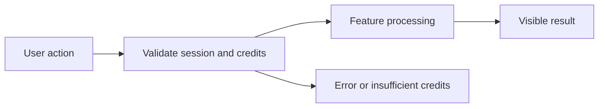

# General Persian Chat PRD

**Status:** Draft — Phase 1 In Progress

## 1. Overview and Business Goal
General Persian Chat is a Phase 1 product specification for Persian-first, credit-transparent user value.

## 2. Target Users and Personas
Persian-speaking individual users, business users, and workspace administrators use this responsive RTL feature.

## 3. User Problems and Jobs to Be Done
Users need clear, safe, credit-aware workflows instead of opaque generic AI tools.

## 4. User Stories
- As a user, I want new conversation so that I can complete the General Persian Chat workflow safely (US-1).
- As a user, I want conversation history so that I can complete the General Persian Chat workflow safely (US-2).
- As a user, I want credit estimate so that I can complete the General Persian Chat workflow safely (US-3).
- As a user, I want stream response so that I can complete the General Persian Chat workflow safely (US-4).
- As a user, I want cancel response so that I can complete the General Persian Chat workflow safely (US-5).
- As a user, I want retry failed request so that I can complete the General Persian Chat workflow safely (US-6).
- As a user, I want insufficient credits so that I can complete the General Persian Chat workflow safely (US-7).
- As a user, I want copy response so that I can complete the General Persian Chat workflow safely (US-8).
- As a user, I want conversation persistence so that I can complete the General Persian Chat workflow safely (US-9).
- As a user, I want admin metadata view so that I can complete the General Persian Chat workflow safely (US-10).

## 5. In Scope (Phase 1 MVP)
- new conversation
- conversation history
- credit estimate
- stream response
- cancel response
- retry failed request
- insufficient credits
- copy response
- conversation persistence
- admin metadata view

## 6. Out of Scope (Phase 1)
- Real payment activation, autonomous external actions, marketplace selling, and multi-step agent planning.

## 7. Functional Requirements
1. The system must support new conversation with authenticated tenant ownership, explicit state, and metadata audit output.
2. The system must support conversation history with authenticated tenant ownership, explicit state, and metadata audit output.
3. The system must support credit estimate with authenticated tenant ownership, explicit state, and metadata audit output.
4. The system must support stream response with authenticated tenant ownership, explicit state, and metadata audit output.
5. The system must support cancel response with authenticated tenant ownership, explicit state, and metadata audit output.
6. The system must support retry failed request with authenticated tenant ownership, explicit state, and metadata audit output.
7. The system must support insufficient credits with authenticated tenant ownership, explicit state, and metadata audit output.
8. The system must support copy response with authenticated tenant ownership, explicit state, and metadata audit output.
9. The system must support conversation persistence with authenticated tenant ownership, explicit state, and metadata audit output.
10. The system must support admin metadata view with authenticated tenant ownership, explicit state, and metadata audit output.

## 8. Non-Functional Requirements
- RTL and Persian quality.
- Accessibility basics and mobile responsiveness.
- CONFIGURED_FEATURE_RESPONSE_TARGET reliability target.
- Privacy-minimized telemetry.
- Credit transparency before billable action.
- Secure HttpOnly cookie session only.

## 9. Key User Flows and States

Loading, empty, network-failure, insufficient-credit, and error states are explicit.

## 10. Edge Cases and Abuse Prevention
Rate limit, tenant isolation, prompt injection defense, idempotency, and content policy checks apply.

## 11. Analytics and Telemetry Events
- general_persian_chat_new_conversation_succeeded
- general_persian_chat_conversation_history_succeeded
- general_persian_chat_credit_estimate_succeeded
- general_persian_chat_stream_response_succeeded
- feature_failed
- insufficient_credits
- security_policy_blocked

## 12. Acceptance Criteria
- [ ] AC-1: new conversation completes with a binary observable result.
- [ ] AC-2: conversation history completes with a binary observable result.
- [ ] AC-3: credit estimate completes with a binary observable result.
- [ ] AC-4: stream response completes with a binary observable result.
- [ ] AC-5: cancel response completes with a binary observable result.
- [ ] AC-6: retry failed request completes with a binary observable result.
- [ ] AC-7: insufficient credits completes with a binary observable result.
- [ ] AC-8: copy response completes with a binary observable result.

## 13. MVP Exit Criteria
Feature tests, RTL review, credit behavior, and security review pass in a future implementation PR.

## 14. Dependencies and Risks
Provider abstraction, wallet reserve/settle, frontend replacement, and policy enforcement are dependencies.

## 15. Open Questions
- Exact credit pricing.
- Provider selection.
- Retention policy.
