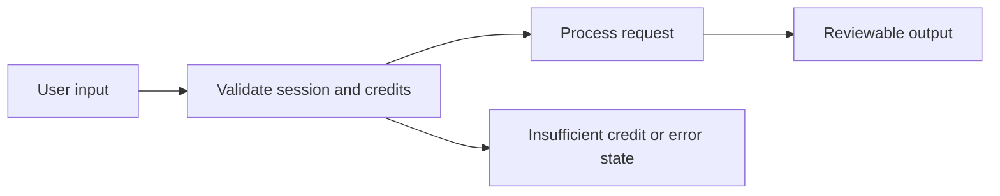

# General Persian Chat PRD

**Status:** Draft — Phase 1 In Progress

## 1. Overview and Business Goal
General Persian Chat is activation/onboarding capability. It supports the Persian AI Business Automation and Creator Commerce Platform through transparent credit-based usage.

## 2. Target Users and Personas
Primary user: Persian-speaking individual or business user. Secondary user: workspace administrator. Persian RTL and mixed Persian/English input are required.

## 3. User Problems and Jobs to be Done
Users need a safe, understandable alternative to manual drafting and disconnected tools. Current alternatives are generic chat, manual copywriting, or opaque credit systems.

## 4. User Stories
- As a Persian-speaking user, I want to send a message so that I can receive a useful streamed response (scenario 1, including happy, error, or edge path).
- As a Persian-speaking user, I want to send a message so that I can receive a useful streamed response (scenario 2, including happy, error, or edge path).
- As a Persian-speaking user, I want to send a message so that I can receive a useful streamed response (scenario 3, including happy, error, or edge path).
- As a Persian-speaking user, I want to send a message so that I can receive a useful streamed response (scenario 4, including happy, error, or edge path).
- As a Persian-speaking user, I want to send a message so that I can receive a useful streamed response (scenario 5, including happy, error, or edge path).
- As a Persian-speaking user, I want to send a message so that I can receive a useful streamed response (scenario 6, including happy, error, or edge path).
- As a Persian-speaking user, I want to send a message so that I can receive a useful streamed response (scenario 7, including happy, error, or edge path).
- As a Persian-speaking user, I want to send a message so that I can receive a useful streamed response (scenario 8, including happy, error, or edge path).

## 5. In Scope (Phase 1 MVP only)
- Authenticated workspace access using secure HttpOnly cookie sessions.
- Persian-first RTL responsive user experience.
- Credit estimate, reserve, settle, or release where a billable operation applies.
- Core flow for General Persian Chat.

## 6. Out of Scope (Phase 1)
- Real payment provider activation.
- Autonomous external publishing, messaging, or account changes.
- Agent planning and multi-step autonomous execution.

## 7. Functional Requirements
1. Accept the documented user input for General Persian Chat.
2. Validate authenticated tenant ownership and request state.
3. Show credit cost before billable execution where available.
4. Use provider-agnostic backend capability boundaries.
5. Return reviewable output or an actionable failure state.
6. Record metadata-only usage and audit events.

## 8. Non-Functional Requirements
- Persian and RTL quality is required.
- Basic accessibility and mobile responsiveness are required.
- Loading and errors must be understandable.
- No browser-accessible authentication token storage.
- Credit cost transparency is required.

## 9. Key User Flows and States

Happy path, loading, empty, insufficient-credit, and network-failure states are explicit UI states. Edge conditions: Provider failure, network failure, insufficient credits, empty conversation.

## 10. Edge Cases and Abuse Prevention
Apply rate limits, prompt-injection defense, tenant isolation, credit manipulation prevention, and content-policy handling. No request may bypass wallet or approval policy.

## 11. Analytics and Telemetry Events
Track opened, input_started, estimate_shown, run_started, run_succeeded, run_failed, insufficient_credits, and output_copied. Use metadata only.

## 12. Acceptance Criteria
- [ ] Authenticated user reaches the feature surface.
- [ ] Persian RTL input and output render correctly.
- [ ] Credit state is shown before and after billable work.
- [ ] Error and network failure states are actionable.
- [ ] Tenant boundaries and metadata-only telemetry are enforced.

## 13. MVP Exit Criteria
Feature flow, automated tests, security review, credit behavior, RTL checks, and product acceptance are complete in a future implementation PR.

## 14. Dependencies and Risks
Dependencies: Provider abstraction, wallet reserve/settle, conversation models. Risks include provider availability, credit settlement correctness, Persian quality, and legacy frontend replacement. Mitigate with focused PRs and tests.

## 15. Open Questions
- Exact credit pricing and estimate model.
- Provider selection and fallback policy.
- Feature-specific rate policy.
- Retention policy for history and outputs.
