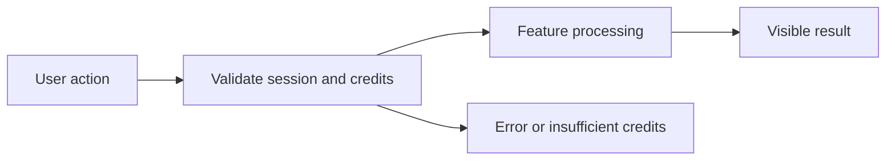

# Instagram Caption Generator PRD

**Status:** Draft — Phase 1 In Progress

## 1. Overview and Business Goal
Instagram Caption Generator is a Phase 1 product specification for Persian-first, credit-transparent user value.

## 2. Target Users and Personas
Persian-speaking individual users, business users, and workspace administrators use this responsive RTL feature.

## 3. User Problems and Jobs to Be Done
Users need clear, safe, credit-aware workflows instead of opaque generic AI tools.

## 4. User Stories
- As a user, I want product description so that I can complete the Instagram Caption Generator workflow safely (US-1).
- As a user, I want target audience so that I can complete the Instagram Caption Generator workflow safely (US-2).
- As a user, I want tone selection so that I can complete the Instagram Caption Generator workflow safely (US-3).
- As a user, I want length selection so that I can complete the Instagram Caption Generator workflow safely (US-4).
- As a user, I want platform selection so that I can complete the Instagram Caption Generator workflow safely (US-5).
- As a user, I want language mode so that I can complete the Instagram Caption Generator workflow safely (US-6).
- As a user, I want hashtag count so that I can complete the Instagram Caption Generator workflow safely (US-7).
- As a user, I want three variations so that I can complete the Instagram Caption Generator workflow safely (US-8).
- As a user, I want copy caption so that I can complete the Instagram Caption Generator workflow safely (US-9).
- As a user, I want regenerate history so that I can complete the Instagram Caption Generator workflow safely (US-10).

## 5. In Scope (Phase 1 MVP)
- product description
- target audience
- tone selection
- length selection
- platform selection
- language mode
- hashtag count
- three variations
- copy caption
- regenerate history

## 6. Out of Scope (Phase 1)
- Real payment activation, autonomous external actions, marketplace selling, and multi-step agent planning.

## 7. Functional Requirements
1. The system must support product description with authenticated tenant ownership, explicit state, and metadata audit output.
2. The system must support target audience with authenticated tenant ownership, explicit state, and metadata audit output.
3. The system must support tone selection with authenticated tenant ownership, explicit state, and metadata audit output.
4. The system must support length selection with authenticated tenant ownership, explicit state, and metadata audit output.
5. The system must support platform selection with authenticated tenant ownership, explicit state, and metadata audit output.
6. The system must support language mode with authenticated tenant ownership, explicit state, and metadata audit output.
7. The system must support hashtag count with authenticated tenant ownership, explicit state, and metadata audit output.
8. The system must support three variations with authenticated tenant ownership, explicit state, and metadata audit output.
9. The system must support copy caption with authenticated tenant ownership, explicit state, and metadata audit output.
10. The system must support regenerate history with authenticated tenant ownership, explicit state, and metadata audit output.

## 8. Non-Functional Requirements
- RTL and Persian quality.
- Accessibility basics and mobile responsiveness.
- CONFIGURED_FEATURE_RESPONSE_TARGET reliability target.
- Privacy-minimized telemetry.
- Credit transparency before billable action.
- Secure HttpOnly cookie session only.

## 9. Key User Flows and States

Loading, empty, network-failure, insufficient-credit, and error states are explicit.

## 10. Edge Cases and Abuse Prevention
Rate limit, tenant isolation, prompt injection defense, idempotency, and content policy checks apply.

## 11. Analytics and Telemetry Events
- instagram_caption_generator_product_description_succeeded
- instagram_caption_generator_target_audience_succeeded
- instagram_caption_generator_tone_selection_succeeded
- instagram_caption_generator_length_selection_succeeded
- feature_failed
- insufficient_credits
- security_policy_blocked

## 12. Acceptance Criteria
- [ ] AC-1: product description completes with a binary observable result.
- [ ] AC-2: target audience completes with a binary observable result.
- [ ] AC-3: tone selection completes with a binary observable result.
- [ ] AC-4: length selection completes with a binary observable result.
- [ ] AC-5: platform selection completes with a binary observable result.
- [ ] AC-6: language mode completes with a binary observable result.
- [ ] AC-7: hashtag count completes with a binary observable result.
- [ ] AC-8: three variations completes with a binary observable result.

## 13. MVP Exit Criteria
Feature tests, RTL review, credit behavior, and security review pass in a future implementation PR.

## 14. Dependencies and Risks
Provider abstraction, wallet reserve/settle, frontend replacement, and policy enforcement are dependencies.

## 15. Open Questions
- Exact credit pricing.
- Provider selection.
- Retention policy.
