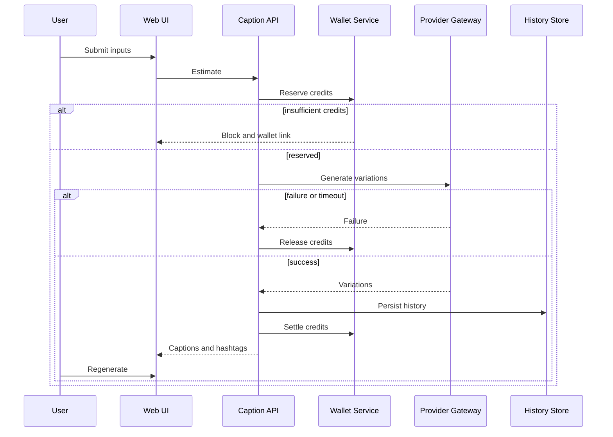

# Instagram Caption Generator PRD

## 1. Document Control

**Status:** Draft — Complete PRD, pending owner review
**Phase:** Phase 1 — In Progress
**Owner:** Product
**Last updated:** 2026-08-20
**Related:** [Chat](GENERAL_CHAT_PRD.md), [Wallet](WALLET_AND_CREDITS_PRD.md), [Prompt Enhancer](PROMPT_ENHANCER_PRD.md), [Phase 1](../roadmap/PHASE_1_CORE_MVP.md)
**Implementation state:** Pending implementation.

## 2. Product Overview and Business Goal

Instagram Caption Generator is the first Studio tool in Persian Content and
Commerce Studio. It creates reviewable captions and hashtags for Persian creators
and shops, using credits per generation. It provides a monetizable bridge from
chat/Prompt Enhancer into commercial Studio workflows.

## 3. Target Users

- Instagram shop owner: needs fast product copy for frequent listings.
- Content creator: needs tone-consistent captions for audience engagement.
- Social media manager: needs variants for distinct client brands.
- Local small-business owner: needs Persian marketing copy without specialist skill.

## 4. User Problems and Jobs to Be Done

- Turn a rough product description into publishable Persian social copy.
- Match a caption to a brand tone without rewriting it manually.
- Create mixed Persian/English hashtags suitable for selected channels.
- Compare multiple options before choosing a caption.
- Know credit impact before generating paid content.

## 5. User Stories

- As a shop owner, I want to describe a product so that I can generate relevant copy.
- As a creator, I want to select tone so that captions match my public voice.
- As a manager, I want length selection so that copy fits campaign format.
- As a marketer, I want platform selection so that wording fits the destination.
- As a bilingual user, I want language mode so that copy matches my audience.
- As a user, I want hashtag count selection so that I control tag density.
- As a user, I want three variations so that I can compare creative approaches.
- As a user, I want copy buttons so that I can reuse caption and tags separately.
- As a returning user, I want history so that I can revisit prior work.
- As a credit-conscious user, I want an estimate so that I can decide to generate.
- As a user with low credits, I want a clear block so that I can open the wallet.
- As a user, I want unsafe description handling so that disallowed content is not generated.

## 6. Phase 1 Scope

- Text product/topic description and optional text audience description.
- Optional text-only image context; image upload and vision analysis are out of scope.
- Tones: professional, casual, funny, promotional, luxury, educational.
- Lengths: short, medium, long.
- Targets: Instagram, Telegram, LinkedIn, Twitter/X.
- Language modes: Persian, English, mixed.
- Hashtag count selection, three variations by default, up to five by user choice.
- Separate caption/hashtag output, character count, platform-fit warning, copy,
  regenerate, history, credit estimate/reserve/settle/release, RTL/error states.

## 7. Out of Scope

Image upload, vision analysis, automatic posting, scheduling, multi-account
management, published-post analytics, competitor analysis, real payment activation,
and bulk CSV import.

## 8. Functional Requirements

1. ICG-FR-001: Authenticated submit accepts description and rejects empty, too-short, or policy-invalid text.
2. ICG-FR-002: Tone selection persists in generation request and returned metadata.
3. ICG-FR-003: Length selection constrains requested caption intent.
4. ICG-FR-004: Platform selection applies destination-specific output constraints.
5. ICG-FR-005: Language mode is sent with the request and displayed with results.
6. ICG-FR-006: Hashtag count selection controls requested hashtag output.
7. ICG-FR-007: API returns credit estimate before provider execution.
8. ICG-FR-008: Insufficient credits block provider execution before generation.
9. ICG-FR-009: Valid generation reserves credits before provider dispatch.
10. ICG-FR-010: Default generation returns three distinct variations; user may request up to five.
11. ICG-FR-011: Each result separates caption text, hashtags, and character count.
12. ICG-FR-012: Copy caption or hashtags performs no credit charge.
13. ICG-FR-013: Regeneration creates a new billable request with visible estimate.
14. ICG-FR-014: Successful outputs persist tenant-scoped history for reopen.
15. ICG-FR-015: Unsafe content produces an actionable policy state and releases any hold.
16. ICG-FR-016: All history and requests enforce tenant isolation.

## 9. UI States

| State | When it appears | Required UI behavior | User action |
|---|---|---|---|
| Empty form | Initial load | Show input guidance | Enter description |
| Form ready | Required fields valid | Enable estimate | Generate |
| Estimating | Inputs submitted | Show credit estimate | Confirm |
| Generating | Credits reserved | Show progress | Cancel |
| Variations displayed | Success | Separate captions and hashtags | Copy or regenerate |
| Copied caption | Copy clicked | Confirm copied | Paste elsewhere |
| Copied hashtags | Tags copied | Confirm copied | Paste elsewhere |
| Regenerating | Retry requested | Show new estimate | Wait |
| History loaded | History opened | Show prior output | Reopen |
| Insufficient credits | Preflight blocked | Link wallet | Add credits |
| Unsafe input | Policy blocked | Explain safe boundary | Edit input |
| Provider failure | Provider error | Preserve inputs | Retry |
| Network failure | Network error | Offer retry | Retry |

## 10. Non-Functional Requirements

- ICG-NFR-001: RTL and Persian text quality are required.
- ICG-NFR-002: Mixed Persian/English hashtags render in readable order.
- ICG-NFR-003: Layout is mobile-first responsive.
- ICG-NFR-004: Keyboard access reaches all form and copy controls.
- ICG-NFR-005: Screen-reader labels identify controls and copy actions.
- ICG-NFR-006: Telemetry is metadata-only.
- ICG-NFR-007: Authentication uses secure HttpOnly cookie sessions.
- ICG-NFR-008: Tenant isolation applies to requests and history.
- ICG-NFR-009: Credit estimate appears before billable actions.

## 11. Sequence Diagram

## 12. Edge Cases and Abuse Controls

Validate empty, one-word, overly long, prohibited, and injection-like descriptions;
prevent duplicate submissions and repeated regeneration loops; handle hashtag limits,
platform switch after generation, and session expiry.

## 13. Analytics Events

| Event | Trigger | Minimal properties | Privacy note |
|---|---|---|---|
| icg_opened | Tool opens | tenant pseudonym | no content |
| icg_form_completed | Required inputs valid | tone, platform | metadata |
| icg_estimate_shown | Estimate returns | credit state | metadata |
| icg_generation_submitted | Generate click | language, length | metadata |
| icg_credits_reserved | Reserve success | request state | metadata |
| icg_generation_succeeded | Output returns | variation count | metadata |
| icg_generation_failed | Failure | error class | metadata |
| icg_credits_settled | Settlement | outcome | metadata |
| icg_credits_released | Release | reason | metadata |
| icg_caption_copied | Copy caption | variation ID | metadata |
| icg_hashtags_copied | Copy tags | variation ID | metadata |
| icg_regenerate_clicked | Regenerate | source ID | metadata |
| icg_history_opened | History view | page | metadata |
| icg_insufficient_credits_shown | Block | estimate state | metadata |

## 14. Acceptance Criteria

- ICG-AC-001: Given valid inputs, when Generate is clicked, then three variations display by default.
- ICG-AC-002: Given variation count selection, when up to five is requested, then that count is returned or failure is shown.
- ICG-AC-003: Given output, when displayed, then hashtags are separate from caption text.
- ICG-AC-004: Given output, when displayed, then character count is visible.
- ICG-AC-005: Given platform selection, when generated, then platform constraint metadata is used.
- ICG-AC-006: Given valid inputs, when estimate returns, then provider dispatch waits for credit reservation.
- ICG-AC-007: Given insufficient credits, when Generate is clicked, then no provider call occurs.
- ICG-AC-008: Given success, when settled, then one final charge is visible.
- ICG-AC-009: Given failure, when provider fails, then reserved credits release.
- ICG-AC-010: Given copy, when selected, then no credits are charged.
- ICG-AC-011: Given regenerate, when confirmed, then a new visible estimate applies.
- ICG-AC-012: Given unsafe input, when submitted, then a policy state is shown.
- ICG-AC-013: Given history, when reopened, then only tenant output is visible.
- ICG-AC-014: Given mixed Persian/English output, when rendered, then RTL layout remains readable.

## 15. MVP Exit Criteria

Future implementation proves generation, credit lifecycle, RTL, safety, tenant
isolation, and error flows through tests.

## 16. Dependencies and Risks

Wallet reserve/settle, provider gateway, history persistence, and frontend
replacement are dependencies. Risks include Persian quality, claims safety, and
credit reconciliation.

## 17. Open Decisions

Credit price per generation/regenerate, default hashtag count, history retention,
maximum description length, provider/model selection, and prohibited-category
ownership: Owner decision required before D2 Technical Contracts approval.
