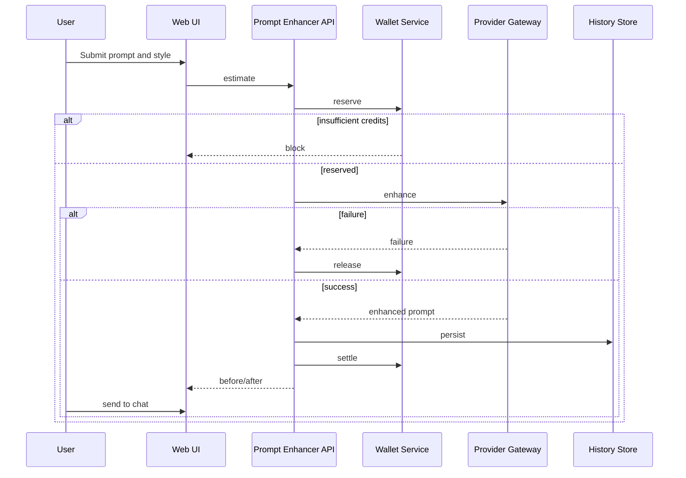

# Prompt Enhancer PRD

## 1. Document Control
**Status:** Draft (pending owner review)
**Phase:** Phase 1 — In Progress
**Owner:** Product
**Approval state:** Owner Approved (via ADR-0002)
**Last updated:** 2026-08-21
Related: [Chat](GENERAL_CHAT_PRD.md), [Wallet](WALLET_AND_CREDITS_PRD.md), [Phase 1](../roadmap/PHASE_1_CORE_MVP.md), [Status](../CURRENT_IMPLEMENTATION_STATUS.md).
Implementation state: Pending implementation.

- [ADR-0002: Phase 1 Owner Decisions](../decisions/0002-phase-1-product-metering-and-infrastructure.md)

## 2. Product Overview and Business Goal
Prompt Enhancer is the first paid Skill. It improves weak prompts, bridges activation chat and Studio tools, uses credits, is Persian-first, supports English, and hands enhanced prompts to General Chat.

## 3. Target Users
First-time creators need prompt guidance; business users need marketing/operations drafts; power users need technical refinement; returning users need history and favorites.

## 4. User Problems and Jobs to Be Done
Users need clearer prompts, explicit style choices, visible credit impact, reusable results, safe handling of unsafe input, and a direct path into chat.

## 5. User Stories
- As a Persian-speaking user, I want raw prompt input so that I can use an enhancement result for a distinct purpose (PE-US-1).
- As a Persian-speaking user, I want creative style selection so that I can use an enhancement result for a distinct purpose (PE-US-2).
- As a Persian-speaking user, I want professional style selection so that I can use an enhancement result for a distinct purpose (PE-US-3).
- As a Persian-speaking user, I want technical style selection so that I can use an enhancement result for a distinct purpose (PE-US-4).
- As a Persian-speaking user, I want marketing style selection so that I can use an enhancement result for a distinct purpose (PE-US-5).
- As a Persian-speaking user, I want concise style selection so that I can use an enhancement result for a distinct purpose (PE-US-6).
- As a Persian-speaking user, I want before and after comparison so that I can use an enhancement result for a distinct purpose (PE-US-7).
- As a Persian-speaking user, I want copy enhanced prompt so that I can use an enhancement result for a distinct purpose (PE-US-8).
- As a Persian-speaking user, I want save favorite so that I can use an enhancement result for a distinct purpose (PE-US-9).
- As a Persian-speaking user, I want history reopen so that I can use an enhancement result for a distinct purpose (PE-US-10).
- As a Persian-speaking user, I want send to chat so that I can use an enhancement result for a distinct purpose (PE-US-11).
- As a Persian-speaking user, I want credit estimate so that I can use an enhancement result for a distinct purpose (PE-US-12).

## 6. Phase 1 Scope
- Raw input; creative, professional, technical, marketing, concise styles; output comparison; copy; favorite; history; send-to-chat; estimate/reserve/settle/release; Persian/English; RTL and error states.

## 7. Out of Scope
Autonomous execution, multi-step planning, marketplace selling, team libraries, image/video specialty prompts, automatic posting, real payment activation, and provider syntax lock-in.

## 8. Functional Requirements
1. PE-FR-001: When user requests raw prompt input, validate session/input, produce the declared state or output, return an actionable failure state, and apply credits only where execution is billable.
2. PE-FR-002: When user requests creative style selection, validate session/input, produce the declared state or output, return an actionable failure state, and apply credits only where execution is billable.
3. PE-FR-003: When user requests professional style selection, validate session/input, produce the declared state or output, return an actionable failure state, and apply credits only where execution is billable.
4. PE-FR-004: When user requests technical style selection, validate session/input, produce the declared state or output, return an actionable failure state, and apply credits only where execution is billable.
5. PE-FR-005: When user requests marketing style selection, validate session/input, produce the declared state or output, return an actionable failure state, and apply credits only where execution is billable.
6. PE-FR-006: When user requests concise style selection, validate session/input, produce the declared state or output, return an actionable failure state, and apply credits only where execution is billable.
7. PE-FR-007: When user requests before and after comparison, validate session/input, produce the declared state or output, return an actionable failure state, and apply credits only where execution is billable.
8. PE-FR-008: When user requests copy enhanced prompt, validate session/input, produce the declared state or output, return an actionable failure state, and apply credits only where execution is billable.
9. PE-FR-009: When user requests save favorite, validate session/input, produce the declared state or output, return an actionable failure state, and apply credits only where execution is billable.
10. PE-FR-010: When user requests history reopen, validate session/input, produce the declared state or output, return an actionable failure state, and apply credits only where execution is billable.
11. PE-FR-011: When user requests send to chat, validate session/input, produce the declared state or output, return an actionable failure state, and apply credits only where execution is billable.
12. PE-FR-012: When user requests credit estimate, validate session/input, produce the declared state or output, return an actionable failure state, and apply credits only where execution is billable.
13. PE-FR-013: When user requests insufficient credits, validate session/input, produce the declared state or output, return an actionable failure state, and apply credits only where execution is billable.
14. PE-FR-014: When user requests unsafe prompt handling, validate session/input, produce the declared state or output, return an actionable failure state, and apply credits only where execution is billable.
15. PE-FR-015: When user requests provider retry, validate session/input, produce the declared state or output, return an actionable failure state, and apply credits only where execution is billable.
16. PE-FR-016: When user requests Persian enhancement, validate session/input, produce the declared state or output, return an actionable failure state, and apply credits only where execution is billable.
17. PE-FR-017: When user requests English enhancement, validate session/input, produce the declared state or output, return an actionable failure state, and apply credits only where execution is billable.

## 9. UI States
| State | When it appears | Required UI behavior | User action |
|---|---|---|---|
| Empty composer | Initial load | Show input guidance | Enter prompt |
| Estimating | Input valid | Show credit estimate | Enhance or edit |
| Enhancing | Reservation exists | Show progress | Cancel |
| Success | Output returned | Show before/after | Copy, save, send |
| Insufficient credits | Preflight reject | Show wallet link | Open wallet |
| Unsafe input | Policy block | Explain safe boundary | Edit prompt |
| Provider failure | Run error | Preserve raw prompt | Retry |

## 10. Non-Functional Requirements
- PE-NFR-001: RTL rendering is required.
- PE-NFR-002: mixed Persian/English is required.
- PE-NFR-003: mobile responsiveness is required.
- PE-NFR-004: keyboard and screen-reader access is required.
- PE-NFR-005: privacy-minimized telemetry is required.
- PE-NFR-006: HttpOnly cookie auth is required.
- PE-NFR-007: tenant isolation is required.
- PE-NFR-008: no browser auth token storage is required.
- PE-NFR-009: credit transparency is required.

## 11. Sequence Diagram

## 12. Edge Cases and Abuse Controls
Empty, too-short, excessively long, repeated, unsafe, injection-like, expired-session, unavailable-chat, and retry requests are validated; favorite requires prior success.

## 13. Analytics Events
| Event | Trigger | Minimal properties | Privacy note |
|---|---|---|---|
| pe_opened | feature transition | tenant pseudonym, state | no raw prompt |
| pe_style_selected | feature transition | tenant pseudonym, state | no raw prompt |
| pe_estimate_shown | feature transition | tenant pseudonym, state | no raw prompt |
| pe_enhancement_submitted | feature transition | tenant pseudonym, state | no raw prompt |
| pe_credits_reserved | feature transition | tenant pseudonym, state | no raw prompt |
| pe_enhancement_succeeded | feature transition | tenant pseudonym, state | no raw prompt |
| pe_enhancement_failed | feature transition | tenant pseudonym, state | no raw prompt |
| pe_credits_settled | feature transition | tenant pseudonym, state | no raw prompt |
| pe_credits_released | feature transition | tenant pseudonym, state | no raw prompt |
| pe_copy_clicked | feature transition | tenant pseudonym, state | no raw prompt |
| pe_favorite_saved | feature transition | tenant pseudonym, state | no raw prompt |
| pe_send_to_chat_clicked | feature transition | tenant pseudonym, state | no raw prompt |
| pe_insufficient_credits_shown | feature transition | tenant pseudonym, state | no raw prompt |

## 14. Acceptance Criteria
- PE-AC-001: Given a valid session, when raw prompt input is requested, then the defined UI and billing outcome is visible.
- PE-AC-002: Given a valid session, when creative style selection is requested, then the defined UI and billing outcome is visible.
- PE-AC-003: Given a valid session, when professional style selection is requested, then the defined UI and billing outcome is visible.
- PE-AC-004: Given a valid session, when technical style selection is requested, then the defined UI and billing outcome is visible.
- PE-AC-005: Given a valid session, when marketing style selection is requested, then the defined UI and billing outcome is visible.
- PE-AC-006: Given a valid session, when concise style selection is requested, then the defined UI and billing outcome is visible.
- PE-AC-007: Given a valid session, when before and after comparison is requested, then the defined UI and billing outcome is visible.
- PE-AC-008: Given a valid session, when copy enhanced prompt is requested, then the defined UI and billing outcome is visible.
- PE-AC-009: Given a valid session, when save favorite is requested, then the defined UI and billing outcome is visible.
- PE-AC-010: Given a valid session, when history reopen is requested, then the defined UI and billing outcome is visible.
- PE-AC-011: Given a valid session, when send to chat is requested, then the defined UI and billing outcome is visible.
- PE-AC-012: Given a valid session, when credit estimate is requested, then the defined UI and billing outcome is visible.

## 15. MVP Exit Criteria
Future implementation proves style selection, billing lifecycle, safety, RTL, history, and handoff through tests.

## 16. Dependencies and Risks
Wallet lifecycle, provider gateway, history store, and frontend replacement are dependencies.

## 17. Owner Decisions (Resolved & Deferred)

**Resolved via ADR-0002:**
- Credit price per enhancement: 2 credits.
- Favorites: Deferred from Phase 1 MVP required scope.
- History retention: 90 days.
- Maximum input length: 2,000 characters.

**Deferred to D2 Technical Contracts:**
- Token-estimation algorithm logic.
- Approved primary and fallback model IDs.
- Provider-routing and fallback rules.
