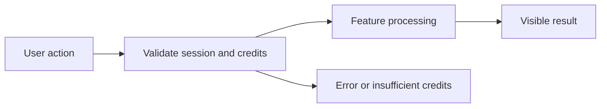

# Prompt Enhancer PRD

**Status:** Draft — Phase 1 In Progress

## 1. Overview and Business Goal
Prompt Enhancer is a Phase 1 product specification for Persian-first, credit-transparent user value.

## 2. Target Users and Personas
Persian-speaking individual users, business users, and workspace administrators use this responsive RTL feature.

## 3. User Problems and Jobs to Be Done
Users need clear, safe, credit-aware workflows instead of opaque generic AI tools.

## 4. User Stories
- As a user, I want raw prompt input so that I can complete the Prompt Enhancer workflow safely (US-1).
- As a user, I want style selection so that I can complete the Prompt Enhancer workflow safely (US-2).
- As a user, I want before after comparison so that I can complete the Prompt Enhancer workflow safely (US-3).
- As a user, I want copy enhanced prompt so that I can complete the Prompt Enhancer workflow safely (US-4).
- As a user, I want favorite enhanced prompt so that I can complete the Prompt Enhancer workflow safely (US-5).
- As a user, I want history view so that I can complete the Prompt Enhancer workflow safely (US-6).
- As a user, I want send to chat so that I can complete the Prompt Enhancer workflow safely (US-7).
- As a user, I want credit estimate so that I can complete the Prompt Enhancer workflow safely (US-8).
- As a user, I want unsafe prompt handling so that I can complete the Prompt Enhancer workflow safely (US-9).
- As a user, I want empty prompt handling so that I can complete the Prompt Enhancer workflow safely (US-10).

## 5. In Scope (Phase 1 MVP)
- raw prompt input
- style selection
- before after comparison
- copy enhanced prompt
- favorite enhanced prompt
- history view
- send to chat
- credit estimate
- unsafe prompt handling
- empty prompt handling

## 6. Out of Scope (Phase 1)
- Real payment activation, autonomous external actions, marketplace selling, and multi-step agent planning.

## 7. Functional Requirements
1. The system must support raw prompt input with authenticated tenant ownership, explicit state, and metadata audit output.
2. The system must support style selection with authenticated tenant ownership, explicit state, and metadata audit output.
3. The system must support before after comparison with authenticated tenant ownership, explicit state, and metadata audit output.
4. The system must support copy enhanced prompt with authenticated tenant ownership, explicit state, and metadata audit output.
5. The system must support favorite enhanced prompt with authenticated tenant ownership, explicit state, and metadata audit output.
6. The system must support history view with authenticated tenant ownership, explicit state, and metadata audit output.
7. The system must support send to chat with authenticated tenant ownership, explicit state, and metadata audit output.
8. The system must support credit estimate with authenticated tenant ownership, explicit state, and metadata audit output.
9. The system must support unsafe prompt handling with authenticated tenant ownership, explicit state, and metadata audit output.
10. The system must support empty prompt handling with authenticated tenant ownership, explicit state, and metadata audit output.

## 8. Non-Functional Requirements
- RTL and Persian quality.
- Accessibility basics and mobile responsiveness.
- CONFIGURED_FEATURE_RESPONSE_TARGET reliability target.
- Privacy-minimized telemetry.
- Credit transparency before billable action.
- Secure HttpOnly cookie session only.

## 9. Key User Flows and States

Loading, empty, network-failure, insufficient-credit, and error states are explicit.

## 10. Edge Cases and Abuse Prevention
Rate limit, tenant isolation, prompt injection defense, idempotency, and content policy checks apply.

## 11. Analytics and Telemetry Events
- prompt_enhancer_raw_prompt_input_succeeded
- prompt_enhancer_style_selection_succeeded
- prompt_enhancer_before_after_comparison_succeeded
- prompt_enhancer_copy_enhanced_prompt_succeeded
- feature_failed
- insufficient_credits
- security_policy_blocked

## 12. Acceptance Criteria
- [ ] AC-1: raw prompt input completes with a binary observable result.
- [ ] AC-2: style selection completes with a binary observable result.
- [ ] AC-3: before after comparison completes with a binary observable result.
- [ ] AC-4: copy enhanced prompt completes with a binary observable result.
- [ ] AC-5: favorite enhanced prompt completes with a binary observable result.
- [ ] AC-6: history view completes with a binary observable result.
- [ ] AC-7: send to chat completes with a binary observable result.
- [ ] AC-8: credit estimate completes with a binary observable result.

## 13. MVP Exit Criteria
Feature tests, RTL review, credit behavior, and security review pass in a future implementation PR.

## 14. Dependencies and Risks
Provider abstraction, wallet reserve/settle, frontend replacement, and policy enforcement are dependencies.

## 15. Open Questions
- Exact credit pricing.
- Provider selection.
- Retention policy.
