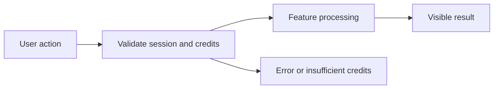

# Wallet and Credits PRD

**Status:** Draft — Phase 1 In Progress

## 1. Overview and Business Goal
Wallet and Credits is a Phase 1 product specification for Persian-first, credit-transparent user value.

## 2. Target Users and Personas
Persian-speaking individual users, business users, and workspace administrators use this responsive RTL feature.

## 3. User Problems and Jobs to Be Done
Users need clear, safe, credit-aware workflows instead of opaque generic AI tools.

## 4. User Stories
- As a user, I want header balance so that I can complete the Wallet and Credits workflow safely (US-1).
- As a user, I want wallet dashboard so that I can complete the Wallet and Credits workflow safely (US-2).
- As a user, I want transaction history so that I can complete the Wallet and Credits workflow safely (US-3).
- As a user, I want date filter so that I can complete the Wallet and Credits workflow safely (US-4).
- As a user, I want feature filter so that I can complete the Wallet and Credits workflow safely (US-5).
- As a user, I want sandbox top-up so that I can complete the Wallet and Credits workflow safely (US-6).
- As a user, I want mock confirmation so that I can complete the Wallet and Credits workflow safely (US-7).
- As a user, I want usage breakdown so that I can complete the Wallet and Credits workflow safely (US-8).
- As a user, I want low balance so that I can complete the Wallet and Credits workflow safely (US-9).
- As a user, I want idempotent request so that I can complete the Wallet and Credits workflow safely (US-10).

## 5. In Scope (Phase 1 MVP)
- header balance
- wallet dashboard
- transaction history
- date filter
- feature filter
- sandbox top-up
- mock confirmation
- usage breakdown
- low balance
- idempotent request

## 6. Out of Scope (Phase 1)
- Real payment activation, autonomous external actions, marketplace selling, and multi-step agent planning.

## 7. Functional Requirements
1. The system must support header balance with authenticated tenant ownership, explicit state, and metadata audit output.
2. The system must support wallet dashboard with authenticated tenant ownership, explicit state, and metadata audit output.
3. The system must support transaction history with authenticated tenant ownership, explicit state, and metadata audit output.
4. The system must support date filter with authenticated tenant ownership, explicit state, and metadata audit output.
5. The system must support feature filter with authenticated tenant ownership, explicit state, and metadata audit output.
6. The system must support sandbox top-up with authenticated tenant ownership, explicit state, and metadata audit output.
7. The system must support mock confirmation with authenticated tenant ownership, explicit state, and metadata audit output.
8. The system must support usage breakdown with authenticated tenant ownership, explicit state, and metadata audit output.
9. The system must support low balance with authenticated tenant ownership, explicit state, and metadata audit output.
10. The system must support idempotent request with authenticated tenant ownership, explicit state, and metadata audit output.

## 8. Non-Functional Requirements
- RTL and Persian quality.
- Accessibility basics and mobile responsiveness.
- CONFIGURED_FEATURE_RESPONSE_TARGET reliability target.
- Privacy-minimized telemetry.
- Credit transparency before billable action.
- Secure HttpOnly cookie session only.

## 9. Key User Flows and States

Loading, empty, network-failure, insufficient-credit, and error states are explicit.

## 10. Edge Cases and Abuse Prevention
Rate limit, tenant isolation, prompt injection defense, idempotency, and content policy checks apply.

## 11. Analytics and Telemetry Events
- wallet_and_credits_header_balance_succeeded
- wallet_and_credits_wallet_dashboard_succeeded
- wallet_and_credits_transaction_history_succeeded
- wallet_and_credits_date_filter_succeeded
- feature_failed
- insufficient_credits
- security_policy_blocked

## 12. Acceptance Criteria
- [ ] AC-1: header balance completes with a binary observable result.
- [ ] AC-2: wallet dashboard completes with a binary observable result.
- [ ] AC-3: transaction history completes with a binary observable result.
- [ ] AC-4: date filter completes with a binary observable result.
- [ ] AC-5: feature filter completes with a binary observable result.
- [ ] AC-6: sandbox top-up completes with a binary observable result.
- [ ] AC-7: mock confirmation completes with a binary observable result.
- [ ] AC-8: usage breakdown completes with a binary observable result.

## 13. MVP Exit Criteria
Feature tests, RTL review, credit behavior, and security review pass in a future implementation PR.

## 14. Dependencies and Risks
Provider abstraction, wallet reserve/settle, frontend replacement, and policy enforcement are dependencies.

## 15. Open Questions
- Exact credit pricing.
- Provider selection.
- Retention policy.
