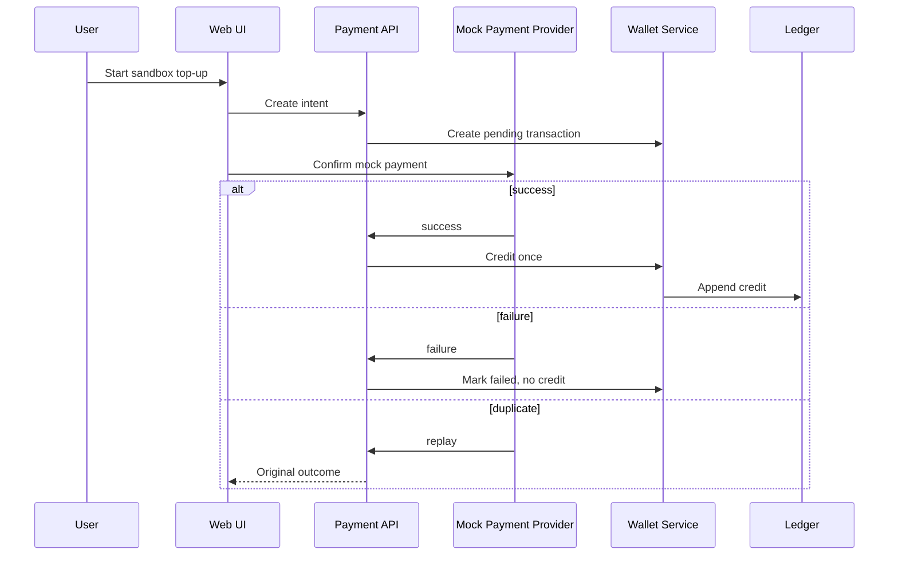
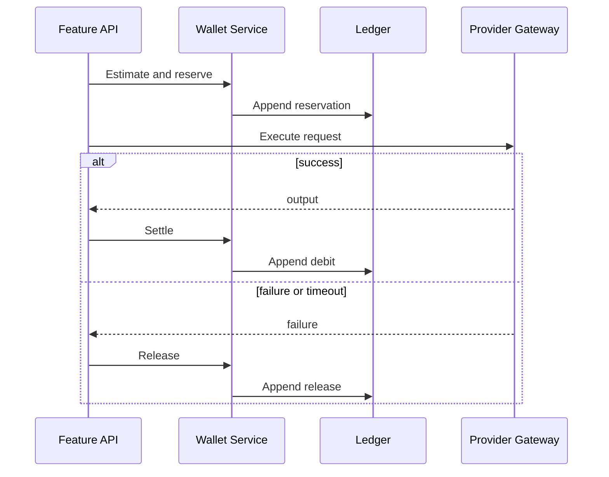

# Wallet & Credits PRD

## 1. Document Control

| Field | Value |
|---|---|
| Status | Draft |
| Phase | Phase 1 In Progress |
| Last updated | 2026-08-20 |
| Related | [Status](../CURRENT_IMPLEMENTATION_STATUS.md), [Phase 1](../roadmap/PHASE_1_CORE_MVP.md), [Chat](GENERAL_CHAT_PRD.md) |

- [ADR-0002: Phase 1 Owner Decisions](../decisions/0002-phase-1-product-metering-and-infrastructure.md)

## 2. Product Overview and Business Goal

Wallet is the commercial trust and billing-transparency layer. Credits are the
only billing unit. Phase 1 uses sandbox/mock payment only; no real provider is
activated. Clear balances, holds, and ledger records build early-adopter trust.

## 3. Target Users

- Individual user: needs current spendable credits before using a feature.
- Business user: needs feature-level usage visibility for operating costs.
- Power user: needs searchable history and receipts for reconciliation.
- Workspace admin: needs metadata-only workspace usage oversight.

## 4. User Problems and Jobs to Be Done

- I ran out of credits mid-task and want an immediate sandbox top-up path.
- I want to know which feature consumed credits before I repeat a request.
- Payment failed and I need clarity without double-charging.
- I need to distinguish reserved credits from settled usage.
- I need a durable history without being able to accidentally alter it.

## 5. User Stories

- As an individual user, I want header balance so I can decide whether to start work.
- As a business user, I want a wallet dashboard so I can review credit activity.
- As a power user, I want transaction history so I can reconcile prior usage.
- As a user, I want date filtering so I can inspect a billing period.
- As a user, I want feature filtering so I can identify Chat, Enhancer, or Caption usage.
- As a user, I want credit/debit filtering so I can separate top-ups from charges.
- As a user, I want status filtering so I can find failed or pending top-ups.
- As a user, I want sandbox top-up creation so I can test credit purchase flow.
- As a user, I want mock confirmation success so I can see credits available once.
- As a user, I want failure feedback so I know no credits were added.
- As a low-balance user, I want warning before a billable action blocks me.
- As an insufficient-balance user, I want a wallet redirect so I can recover.
- As a user, I want usage breakdown so I can understand feature consumption.
- As a user, I want a receipt view so I can reference a successful top-up.
- As a workspace admin, I want metadata-only usage so I can monitor without private content.

## 6. Phase 1 Scope

Available balance; navigation balance; dashboard; append-only history; pagination;
date, feature, direction, and status filters; usage breakdown; sandbox intent;
mock confirmation; pending/succeeded/failed/canceled states; receipt display;
low-balance warning; insufficient-balance recovery; reserve/settle/release
visibility; idempotent duplicate handling.

## 7. Out of Scope

Real gateways, stored cards, bank integrations, external-method refunds, tax
invoices, currency conversion, subscriptions, promotional credits, and manual
ledger editing.

## 8. Functional Requirements

1. WALLET-FR-001: On authenticated wallet request, read the authoritative backend balance and return available/reserved state; failure returns no fabricated balance.
2. WALLET-FR-002: After login, navigation requests current balance and renders a loading state until response or error.
3. WALLET-FR-003: Wallet dashboard opens only for the authenticated tenant and returns an unauthorized state otherwise.
4. WALLET-FR-004: History returns immutable entries most-recent-first with page metadata.
5. WALLET-FR-005: Date input narrows history to matching timestamps or shows no-results.
6. WALLET-FR-006: Feature filter narrows entries by Chat, Prompt Enhancer, or Caption Generator.
7. WALLET-FR-007: Direction filter separates credits from debits without changing balance.
8. WALLET-FR-008: Status filter separates pending, succeeded, failed, and canceled records.
9. WALLET-FR-009: Sandbox top-up request creates a uniquely identified mock payment intent.
10. WALLET-FR-010: Intent creation exposes pending state and does not credit balance.
11. WALLET-FR-011: Successful mock confirmation creates one sandbox credit ledger entry and refreshes balance.
12. WALLET-FR-012: Failed mock confirmation records failure and never credits balance.
13. WALLET-FR-013: Duplicate confirmation returns original outcome and never double-credits.
14. WALLET-FR-014: History is read-only; users cannot edit or delete ledger entries.
15. WALLET-FR-015: Usage breakdown aggregates visible feature entries without exposing other tenants.
16. WALLET-FR-016: Low balance displays a warning before an eligible billable action.
17. WALLET-FR-017: Insufficient balance links to wallet recovery before provider execution.
18. WALLET-FR-018: Succeeded sandbox top-ups expose receipt data or an MVP-optional receipt state.
19. WALLET-FR-019: Every balance, intent, and history query enforces tenant isolation.

## 9. Transaction State Model

| State | Allowed transitions | Balance impact | User-visible status | Retry behavior |
|---|---|---|---|---|
| pending | succeeded, failed, canceled | none | Awaiting confirmation | same idempotency key |
| succeeded | none | one credit entry | Credits added | replay returns success |
| failed | none | none | Payment failed | new intent required |
| canceled | none | none | Canceled | new intent required |
| idempotent replay | original state | no new entry | Original result | no duplicate action |

## 10. Ledger Entry Types

- Sandbox top-up credit: credits from successful mock confirmation.
- Usage reservation: temporary hold before billable execution.
- Usage settlement: debit recording completed usage.
- Usage release: new reversal-of-hold entry after failure or cancellation.

Ledger history is append-only; historical entries are never mutated or deleted.
Corrective entries are an Open Decision: Owner decision required before D2.

## 11. UI States

| State | When it appears | Required UI behavior | User action |
|---|---|---|---|
| Loading balance | Session opens | Show non-sensitive loading indicator | Wait or refresh |
| Balance loaded | Balance returns | Show available and reserved state | Open wallet |
| Empty history | No entries | Explain no activity yet | Start top-up |
| History loaded | Entries return | Show recent-first rows | Filter or paginate |
| Top-up form | User selects add credits | Show sandbox notice | Submit intent |
| Top-up pending | Intent created | Prevent duplicate confirmation | Confirm mock result |
| Top-up succeeded | Mock success | Refresh balance and receipt | View receipt |
| Top-up failed | Mock failure | Explain no credits added | Start new intent |
| No filter results | Filter excludes entries | Show clear empty state | Clear filter |
| Low balance | Approved policy detects low balance | Show warning | Open wallet |
| Insufficient balance | Billable request rejected | Link to wallet | Add sandbox credits |
| Network failure | API unavailable | Preserve last known display label | Retry |
| Duplicate confirmation | Replay detected | Show original outcome | Return to wallet |

## 12. Non-Functional Requirements

- WALLET-NFR-001: Navigation and dashboard display the same authoritative balance after refresh.
- WALLET-NFR-002: Wallet queries enforce tenant isolation.
- WALLET-NFR-003: RTL layout preserves readable credit values and labels.
- WALLET-NFR-004: Mobile layout keeps balance and recovery actions reachable.
- WALLET-NFR-005: Keyboard and screen-reader controls expose filters and receipts.
- WALLET-NFR-006: Duplicate confirmations are idempotent.
- WALLET-NFR-007: Telemetry contains metadata only.
- WALLET-NFR-008: Authentication uses HttpOnly cookie sessions; browser token storage is prohibited.
- WALLET-NFR-009: Ledger history is read-only for users and administrators.
- WALLET-NFR-010: Real payment provider activation is excluded from Phase 1.

## 13. Sequence Diagrams

## 14. Edge Cases and Abuse Controls

Handle duplicate confirmations, concurrent top-ups, settlement after applicable
expiration policy, double-spend attempts, cross-tenant access, unauthenticated
wallet access, refresh races, large-history pagination, manual ledger edit attempts,
and attempts to activate real payment in Phase 1.

## 15. Analytics Events

| Event name | Trigger | Minimal properties | Privacy note |
|---|---|---|---|
| wallet_dashboard_opened | Dashboard view | tenant, state | no content |
| wallet_balance_viewed | Balance visible | balance state | no raw ledger |
| wallet_transaction_history_loaded | History response | page, count | metadata only |
| wallet_filter_applied | Filter change | filter type | metadata only |
| topup_intent_created | Intent request | intent state | no payment detail |
| topup_mock_confirmed | Mock response | outcome | metadata only |
| topup_succeeded | Credit applied | transaction ID | metadata only |
| topup_failed | Failure recorded | error class | metadata only |
| credits_reserved | Feature hold | feature | metadata only |
| credits_settled | Usage debit | feature | metadata only |
| credits_released | Hold release | reason class | metadata only |
| credits_insufficient_shown | Preflight reject | feature | metadata only |
| wallet_receipt_viewed | Receipt click | transaction ID | metadata only |

## 16. Acceptance Criteria

- WALLET-AC-001: Given login, when navigation loads, then current balance is visible.
- WALLET-AC-002: Given history, when dashboard opens, then entries are recent-first.
- WALLET-AC-003: Given a date filter, when applied, then only matching entries display.
- WALLET-AC-004: Given a sandbox top-up, when intent starts, then a pending transaction displays.
- WALLET-AC-005: Given mock success, when confirmed, then balance credits exactly once.
- WALLET-AC-006: Given mock failure, when confirmed, then balance does not increase.
- WALLET-AC-007: Given duplicate confirmation, when replayed, then no second credit exists.
- WALLET-AC-008: Given billable usage, when settled, then a visible ledger entry exists.
- WALLET-AC-009: Given released reservation, when release completes, then spendable credits restore.
- WALLET-AC-010: Given history read, when viewed, then balance does not change.
- WALLET-AC-011: Given another tenant wallet ID, when requested, then access is denied.
- WALLET-AC-012: Given insufficient credits, when action starts, then wallet recovery link displays.
- WALLET-AC-013: Given a receipt, when viewed, then ledger data remains immutable.
- WALLET-AC-014: Given Phase 1, when top-up runs, then no real payment provider is active.

## 17. MVP Exit Criteria

Sandbox top-up, history, reserve/settle/release, tenant isolation, auditable
read-only ledger, and no double-credit/double-charge are proven by future tests.

## 18. Dependencies and Risks

Wallet/ledger foundations and mock intents exist but require end-to-end validation.
Frontend remains legacy. Pricing, credit packages, reservation expiration, and
receipt retention are undecided.

## 19. Owner Decisions (Resolved & Deferred)

**Resolved via ADR-0002:**
- Credit package sizes: 100, 500, and 2,000 credits.
- Low-balance warning threshold: Below 20 credits.
- Reservation expiration: 10 minutes.
- Receipt retention: 12 months.
- Reserved balance visibility: Yes, shown separately from available balance.
- Corrective ledger entries: Immutable ledger; compensating entries only.
- Admin visibility: Billing metadata only; no feature content.

**Deferred to D2 Technical Contracts:**
- Idempotency and quote-validity duration limits.
- Pricing-variance telemetry implementation.

**Deferred Beyond D2:**
- Real fiat prices and currency exchange logic.
- Real payment gateway activation.
- Recurring subscriptions.
